<div align="center">

# gitrade

**The only exchange where you can short `$COMMIT`. On GitHub. In a README.**

[](https://github.com/saksham10arora-dotcom/gitrade/actions)
[](https://github.com/saksham10arora-dotcom/gitrade/issues)
[](market.py)
[](state.json)

[**Live Dashboard**](https://saksham10arora-dotcom.github.io/gitrade/) &nbsp;·&nbsp; [Open a Trade](https://github.com/saksham10arora-dotcom/gitrade/issues/new) &nbsp;·&nbsp; [Order History](https://github.com/saksham10arora-dotcom/gitrade/issues?q=is%3Aissue)

</div>

---

## How to Trade

Open a new issue. The title IS your order. The matching engine runs on every issue open and every 5 min.

| Order Type | Title Format | Example |
|------------|-------------|---------|
| Limit buy | `BUY {qty} {ticker} @ {price}` | `BUY 10 STAR @ 100` |
| Limit sell | `SELL {qty} {ticker} @ {price}` | `SELL 5 COMMIT @ 48` |
| Market buy | `MARKET BUY {qty} {ticker}` | `MARKET BUY 10 FORK` |
| Market sell | `MARKET SELL {qty} {ticker}` | `MARKET SELL 5 STAR` |
| Cancel | `CANCEL #{issue_number}` | `CANCEL #7` |

Tickers: **`$STAR`** **`$COMMIT`** **`$FORK`** -- the currency of GitHub, traded on GitHub.

---

## Exchange Stats

<!-- STATS_START -->
| Ticker | Last | Volume | Spread |
|--------|------|--------|--------|
| **$STAR** | 98.00 | 30 | -- |
| **$COMMIT** | 48.00 | 20 | -- |
| **$FORK** | 9.00 | 100 | -- |
<!-- STATS_END -->

<!-- MERMAID_START -->
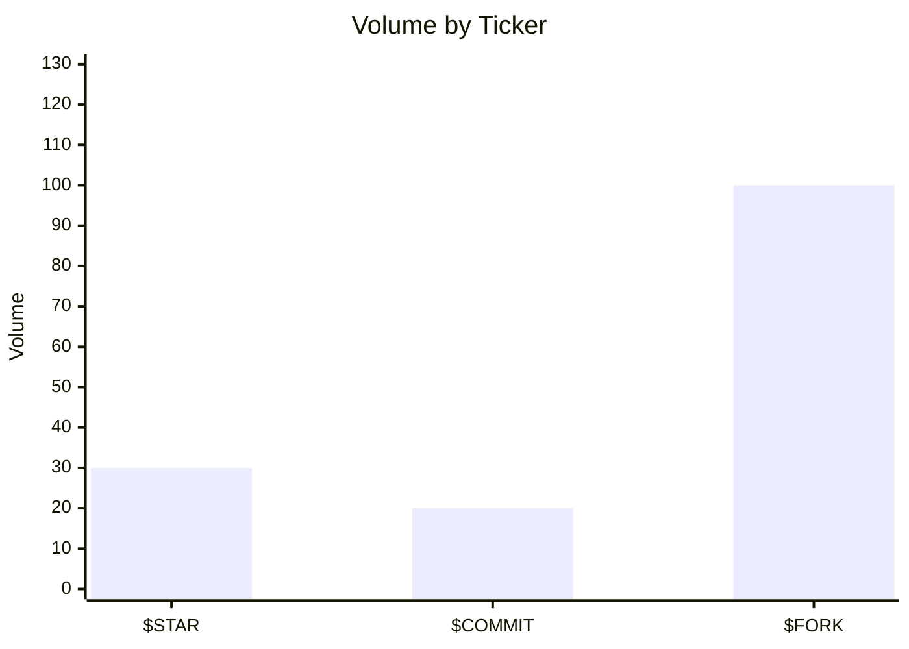
<!-- MERMAID_END -->

---

## $STAR &nbsp; `GitHub Stars`

<!-- STAR_START -->
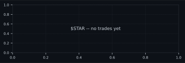 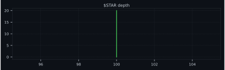

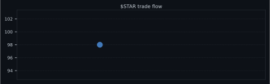

**Order Book**

| Bid Qty | Price | Ask Qty |
|--------:|------:|:--------|
| **20** | 100.00 |  |

**Recent Trades**

| Time | Price | Qty |
|------|------:|----:|
| 17:42 UTC | 98.00 | 30 |
<!-- STAR_END -->

---

## $COMMIT &nbsp; `GitHub Commits`

<!-- COMMIT_START -->
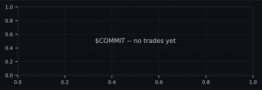 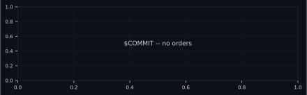

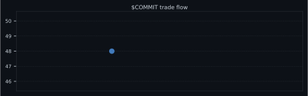

**Order Book**

| Bid Qty | Price | Ask Qty |
|--------:|------:|:--------|
| | *empty* | |

**Recent Trades**

| Time | Price | Qty |
|------|------:|----:|
| 17:44 UTC | 48.00 | 20 |
<!-- COMMIT_END -->

---

## $FORK &nbsp; `GitHub Forks`

<!-- FORK_START -->
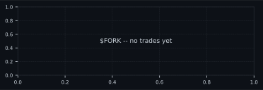 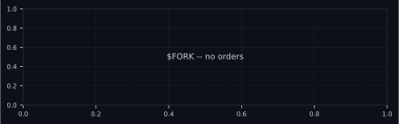

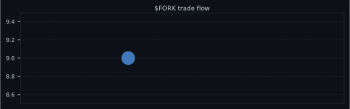

**Order Book**

| Bid Qty | Price | Ask Qty |
|--------:|------:|:--------|
| | *empty* | |

**Recent Trades**

| Time | Price | Qty |
|------|------:|----:|
| 17:43 UTC | 9.00 | 100 |
<!-- FORK_END -->

---

## Leaderboard

<!-- LEADERBOARD_START -->
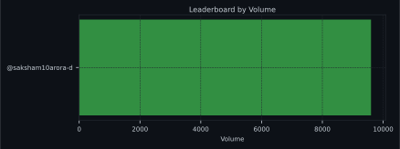

| Rank | Trader | Volume | Trades | P&L |
|------|--------|--------|--------|-----|
| 1 | @saksham10arora-dotcom | 9,600 | 6 | +0 |
<!-- LEADERBOARD_END -->

---

## How It Works

```
GitHub Issue: "BUY 10 STAR @ 100"
        ↓
GitHub Actions  (triggers on issue open + cron every 5 min)
        ↓
market.py       parse order → match → update portfolio + leaderboard
charts.py       regenerate 10 SVGs (price, depth, flow per ticker + leaderboard)
        ↓
state.json + README.md + assets/  committed to main
```

- **Matching:** price-time priority (FIFO at each price level)
- **Limit orders:** full fills only
- **Market orders:** partial fills, fills at best available price
- **Cancel:** `CANCEL #<issue_number>` removes your order from the book
- **State:** lives in `state.json` -- the repo IS the exchange

<!-- TIMESTAMP_START -->
> Last updated: 2026-05-26 21:18 UTC
<!-- TIMESTAMP_END -->
